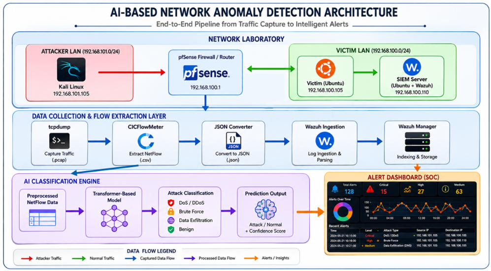
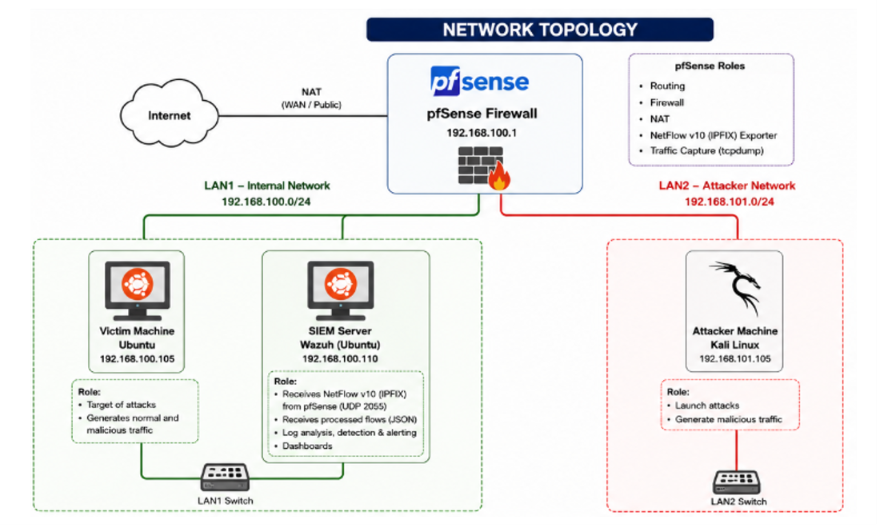
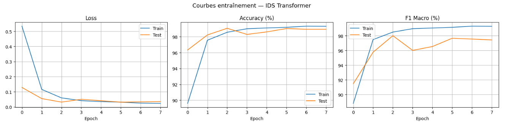
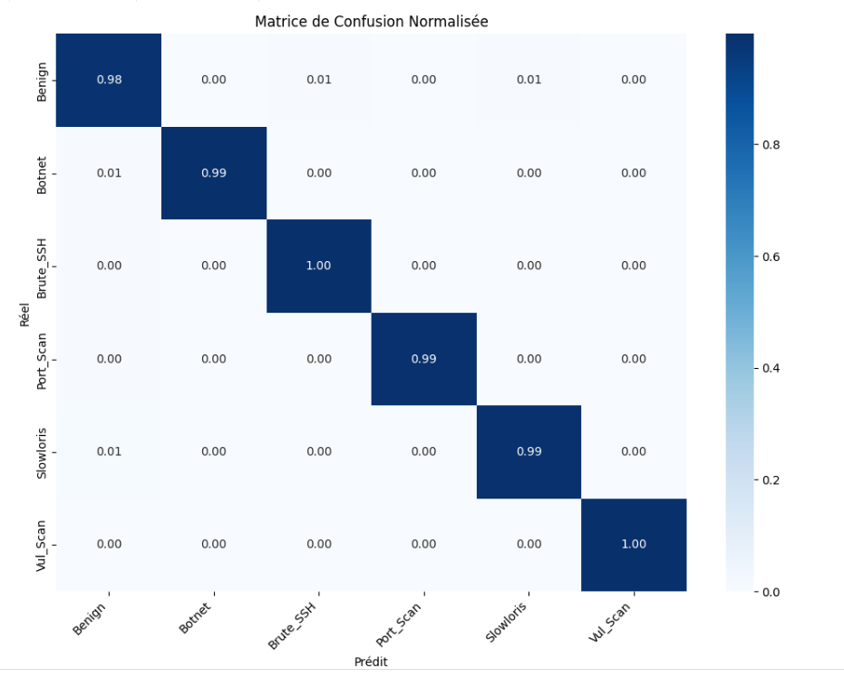
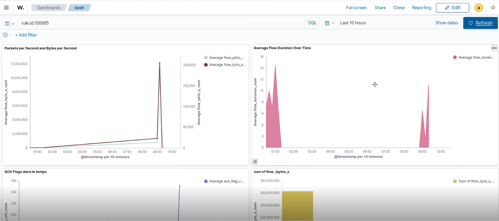
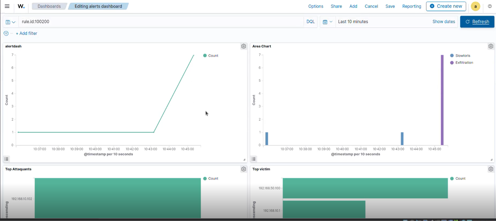
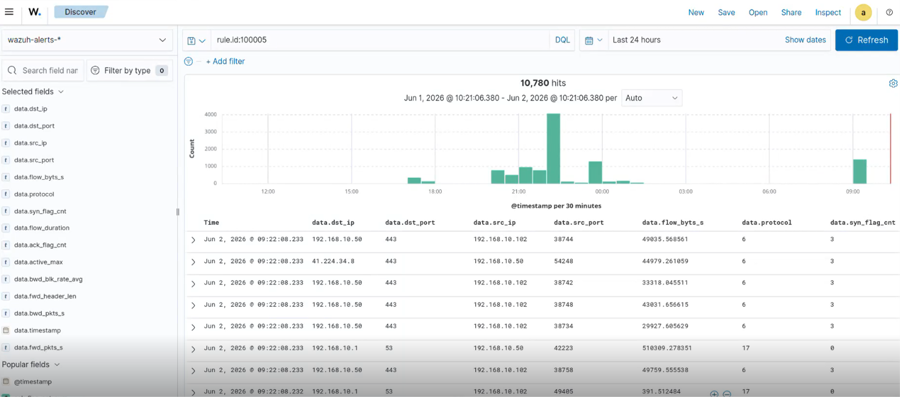
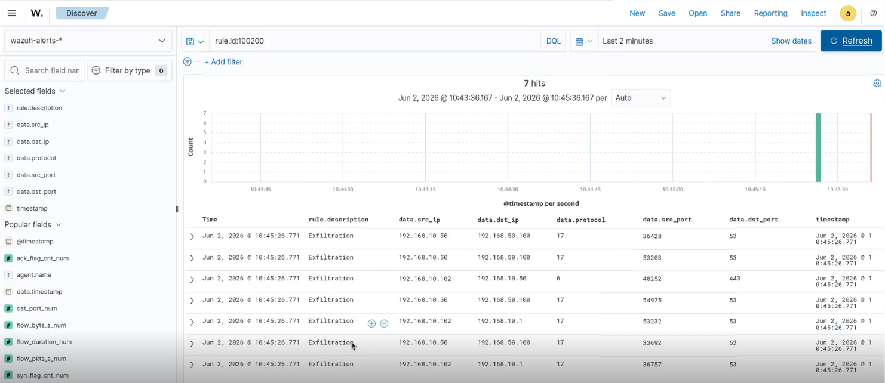

# AI-Based Network Anomaly Detection Using NetFlow

## Overview

This project presents a complete AI-powered Network Intrusion Detection System (NIDS) capable of detecting cyberattacks from NetFlow traffic in real time.

The solution combines:

- NetFlow/IPFIX traffic monitoring
- CICFlowMeter flow generation
- Wazuh SIEM integration
- Transformer-based Deep Learning
- Real-time alert generation
- Custom attack dataset generation

The system was developed as part of an engineering project at Sup'Com.

---

## System Architecture



The proposed architecture performs end-to-end intrusion detection:

1. Traffic capture at the pfSense gateway
2. Flow extraction and processing
3. Wazuh SIEM ingestion
4. AI-based classification using a Transformer model
5. Real-time alert generation and visualization

---

## Network Topology



The experimental environment was implemented using VirtualBox and consists of:

- pfSense Gateway
- Wazuh SIEM Server
- Ubuntu Victim Machine
- Kali Linux Attacker Machine

---

## Features

### NetFlow Monitoring

- NetFlow v10 (IPFIX)
- Flow-based traffic analysis
- Encrypted traffic visibility

### SIEM Integration

- Wazuh Dashboard Integration
- Real-time monitoring
- Custom security alerts

### AI-Based Detection

- Transformer Encoder Architecture
- Temporal sequence analysis
- Multi-class attack classification

---

## Attack Scenarios

The system was tested against multiple attack categories:

- SYN Flood DoS
- SSH Brute Force
- DNS Exfiltration
- Slow HTTP Attack

---

## Dataset Generation

Unlike traditional approaches relying only on public datasets, this project includes the generation of a custom NetFlow dataset using real attack scenarios performed in the virtualized laboratory.

The workflow is:

Traffic Generation

↓

PCAP Capture

↓

NetFlow Extraction

↓

Feature Extraction using CICFlowMeter

↓

Labeling

↓

Dataset Creation

↓

Model Training

---

## Deployment Pipeline

### logs_reader_and_converter.sh

This script:

- Reads PCAP files captured on pfSense
- Extracts NetFlow records
- Converts flows to JSON format
- Sends logs to Wazuh
- Generates CSV files for AI processing

### realtime_model_watcher.py

This script:

- Monitors generated CSV flow files
- Preprocesses flow records
- Runs inference using the trained Transformer model
- Generates attack alerts
- Sends alerts to Wazuh in JSON format

---

## Training Pipeline

The model training process includes:

- Feature Selection
- One-Hot Encoding
- Standardization
- Sliding Window Aggregation
- Class Balancing
- Transformer Training

Notebook:

```text
notebooks/transformer_training.ipynb
```

---

## Transformer Architecture

The model uses:

- Input Projection Layer
- Learnable Positional Encoding
- Transformer Encoder
- Attention Pooling
- Linear Classification Head

Main Parameters:

| Parameter | Value |
|------------|---------|
| Embedding Dimension | 32 |
| Encoder Layers | 1 |
| Attention Heads | 2 |
| Feed Forward Dimension | 64 |
| Dropout | 0.1 |

---

## Results

### Training Curves



### Confusion Matrix



The model achieved:

- Accuracy > 99%
- Macro F1 Score > 99%

---

## Wazuh Dashboards

### General Dashboard



### Alerts Dashboard



### NetFlow Interface



### Alerts Interface



---

## Demonstration Video

A complete demonstration of the system is available in:

```text
demo/demo.mp4
```

---

## Repository Structure

```text
AI-NetFlow-Anomaly-Detection
│
├── deployment/
├── model/
├── screenshots/
├── demo/
├── docs/
└── README.md
```

---

## Technologies Used

- Python
- PyTorch
- Pandas
- Scikit-Learn
- Wazuh
- pfSense
- VirtualBox
- Kali Linux
- Ubuntu
- CICFlowMeter
- NetFlow/IPFIX

---

## Authors

Ahmed Abdelhedi

Morsi Feki

---

## Supervisor

Prof. Slim Rekhis

---

## Future Work

- Autoencoder-based anomaly detection
- Zero-day attack detection
- XDR integration
- Adversarial robustness evaluation
- Multi-dataset training
